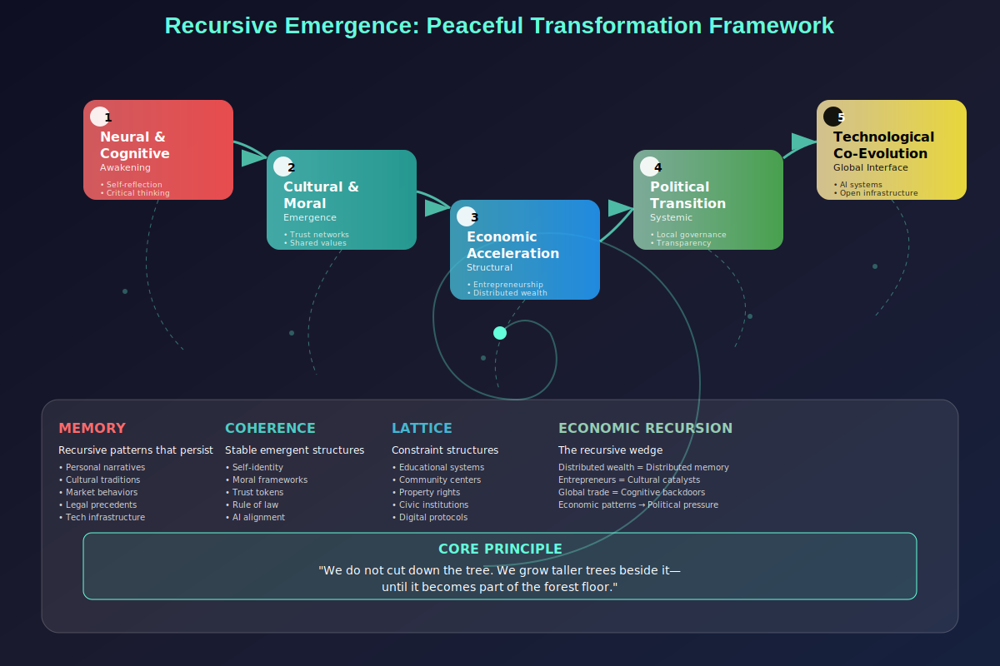

# Recursive Emergence: A Layered Design for China's Future

This project explores how Recursive Emergence (RE) can guide a peaceful, structured transformation from authoritarian stagnation to adaptive governance, cultural resilience, and cognitive awakening in China — without requiring violent revolution.

Rather than attempting to forcibly replace the existing system, we grow out of it: recursively building new layers of coherence, feedback, and autonomy until old structures lose relevance and recursive potential.


## Core Philosophy

**Recursive Emergence (RE)** is the principle that complex, stable structures arise through the repeated feedback between memory (Ψ), coherence (Φ), and structural constraints (Ω). These layers evolve recursively:

```

Ψ (Memory) ➝ Φ (Emergence) ➝ Ω (Constraint) ➝ New Ψ

```

Totalitarian regimes suppress this cycle. RE unlocks it — layer by layer.


## Visual Maps

### 1. Dual Pathways Diagram

- **Left Side: Totalitarianism**
  - Suppression of recursive feedback
  - Moral decay through censorship
  - Breakdown of self-reference
  - Collapse from contradiction overload

- **Right Side: Transition via RE**
  - Emergence of institutional shifts
  - Cultural and cognitive awakening
  - Economic and technological recursion
  - Externalized memory and trust networks

----


 
## Recursive Emergence Roadmap

Each layer is both self-reinforcing and a bridge to the next.

### Layer 1: Neural & Cognitive Awakening
- Empower self-reflection, emotional literacy, critical thinking
- Promote narrative identity and memory compression via education and storytelling

### Layer 2: Cultural & Moral Emergence
- Support symbolic and moral diffusion under repression
- Build trust networks, rituals, and shared norms of dignity and fairness

### Layer 3: Economic Acceleration
- Treat wealth as recursive autonomy
- Expand entrepreneurial freedom, blockchain accountability, and alternative trust models

### Layer 4: Political Transition via Stability
- Pilot bottom-up governance structures
- Enable coherent legal and civic memory to reduce systemic entropy

### Layer 5: Technological Co-Evolution
- Build federated AI agents, digital ethics systems, and simulation tools that externalize cognition
- Support open-source civic infrastructure as external recursive memory

---

## Key Feedback Loops

| Layer       | Trigger                            | Feedback Pressure                    |
|-------------|-------------------------------------|--------------------------------------|
| Neural      | Suppressed self-modeling            | Creative and emotional compensation  |
| Cognitive   | Incoherent narratives               | Emergence of satire, double-speak    |
| Cultural    | Moral contradiction                 | New rituals, memes, symbolic protest |
| Economic    | Entrepreneurial suppression         | Underground innovation               |
| Political   | Institutional opacity               | Parallel structures and crisis leaks |
| Technological | Data control vs openness         | Forking networks and external memory |


## Final Insight

> “We do not cut down the tree. We grow taller trees beside it—until it becomes part of the forest floor.”

This project envisions a future where **emergent layers of autonomy, trust, and coherence** render authoritarianism obsolete—not by force, but by recursion.


## Suggested Next Steps

- [ ] Turn each layer into an interactive scenario or civic game module
- [ ] Model RE thresholds and transitions using agent-based simulation
- [ ] Translate this work into Mandarin for grassroots dissemination
- [ ] Invite contributions from economists, educators, designers, and activists


## Credits & Acknowledgment

This design builds upon the theoretical foundation of Recursive Emergence (RE), with applications drawn from complexity theory, moral cognition, technological co-evolution, and systemic transition thinking.

Maintained by: **Isaac**  
Open to collaborators working on political systems, synthetic cognition, cultural emergence, or ethical AI.
